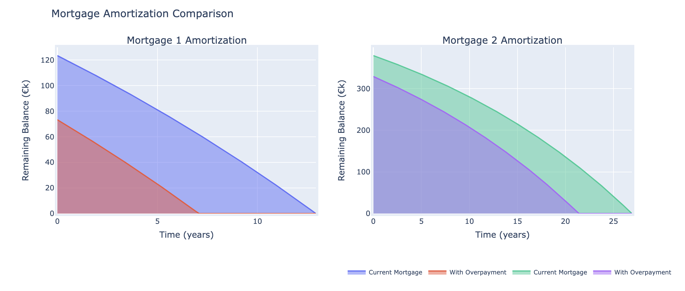

# Mortgage Amortization Calculator :house_with_garden:

## Welcome to Your Strategic Mortgage Planning Tool

Welcome to the Mortgage Amortization Calculator! This tool is designed to help you understand and compare different mortgage plans, taking into account factors like lump sum payments and additional monthly payments, and how they affect your total interest and the term of the mortgage.

### What This Tool Can Do For You

This calculator provides a comprehensive view of how different mortgage structures can impact your financial trajectory. Whether you're exploring commercial real estate investments or managing your personal property portfolio, this tool offers:

- **Detailed Comparisons**: Assess various mortgage plans side-by-side to understand how each affects your finances over the long term. Compare how increasing your down payment or choosing different loan terms can influence your interest payments and equity build-up.

- **Customization and Flexibility**: Input specific details about mortgages, such as the principal amount, the term of the loan, and the interest rate. Further tailor your analysis by incorporating variables like lump sum payments at any stage of the loan or adjusting monthly payments according to your cash flow scenarios.

- **Visual Insights**: Leverage detailed amortization schedules and dynamic graphs to visualize payment structures and how they affect the loan balance over time. This visual representation can be instrumental in presentations to stakeholders or in strategic discussions with your finance team.

- **Strategic Financial Planning**: Understand the implications of additional payments and how they can reduce long-term interest costs, helping you make informed decisions that align with your business strategies and financial goals.

### Getting Started

The tool is designed to be user-friendly, guiding you through the necessary steps to input your mortgage details and view various scenarios. It requires minimal setup, and you can start using it immediately after a quick installation of its supporting libraries.

## Installation :wrench:

To get started with the Mortgage Amortization Calculator, follow these steps:

```bash
# Clone the repository
git clone https://github.com/yourusername/Mortgage-Amortization-Tool.git
cd Mortgage-Amortization-Tool

# Install required Python libraries
pip install numpy matplotlib pandas plotly ipywidgets numpy_financial
```

## Usage :computer:

Run the Jupyter Notebook in your local environment:

```bash
jupyter notebook MortgageCalculatorPro.ipynb
```

Follow the prompts in the notebook to enter your mortgage details:

- Enter the principal amount.
- Specify the term of the loan in years.
- Input the annual interest rate.

You can also specify:

- Any lump sum payments.
- Additional monthly payments.

The calculator will then display detailed amortization schedules and graphs comparing your inputted mortgage plans.

## Technical Details :gear:

This calculator uses the following Python libraries to perform calculations and generate visualizations:

- **NumPy**: For numerical operations.
- **Matplotlib and Plotly**: For generating interactive visualizations.
- **Pandas**: For data manipulation and presentation.
- **numpy_financial**: For financial calculations like monthly payments.

The core functionality is encapsulated in functions that calculate monthly payments, generate amortization schedules, and assess the impact of extra payments on interest savings.

## Financial Insights :dollar:

- **Understand Your Mortgage**: Visualize how your payment affects the principal and interest over time.
- **Compare Scenarios**: Side-by-side comparison of different payment strategies and their long-term impact.
- **Save on Interest**: Learn how additional payments can decrease the total amount of interest paid and shorten your loan term.

## Visual Insights :bar_chart:

The Mortgage Amortization Calculator goes beyond basic data tabulation by providing dynamic, interactive visualizations that bring financial data to life. These visual tools are crucial for grasping complex financial concepts quickly and for communicating these concepts effectively to stakeholders.

### How Visualizations Enhance Your Strategic Planning:



- **Amortization Graphs**: See a visual representation of your payment schedule over the life of the mortgage. These graphs break down each payment into principal and interest components, showing how each payment contributes to reducing your overall debt and building equity in your property.

- **Interest and Principal Over Time**: Track how much of your money goes towards interest versus principal each month. This visualization helps you understand the true cost of borrowing and how prepayments can alter the cost structure in your favor.

- **Cumulative Savings Graphs**: For scenarios involving additional payments, the calculator provides graphs that illustrate the cumulative effect of these payments on interest savings and loan term reduction. This can be a powerful motivator and a strategic tool, demonstrating the long-term financial benefits of upfront investment in your mortgage.

- **Scenario Comparison**: Easily compare different mortgage configurations. For example, see side-by-side how a 15-year mortgage compares to a 30-year mortgage in terms of total interest paid and how quickly equity is built. This tool can guide strategic decisions, such as choosing between higher monthly payments with more rapid equity build-up and lower payments that allow for greater monthly cash flow flexibility.

### Key Insights You Can Derive:

- **Optimal Payment Strategies**: Determine the most cost-effective strategies for loan repayment by seeing how variations in payment schedules affect the total interest paid and the timeline for loan payoff.

- **Financial Forecasting**: Use the detailed graphs to forecast future financial states based on different mortgage terms, helping you plan for other investments or financial needs with greater accuracy.

- **Risk Assessment**: Visualize the impact of interest rate changes or different types of mortgages (e.g., fixed vs. adjustable rate) on your long-term financial obligations, providing a clear picture that can inform risk management decisions.

These visualizations are not just informative—they are tools for strategic thinking, enabling clearer decision-making and providing a solid foundation for discussions with financial advisors, stakeholders, and lenders. Whether you're presenting to the board, discussing options with financial planners, or planning your personal finances, these tools provide clarity and insight that empower you to make informed decisions.


## Contributing :handshake:

Feel free to fork this project and submit pull requests. You can also open an issue if you find bugs or have feature requests.

## License :memo:

This project is licensed under the MIT License - see the LICENSE.md file for details.

## Acknowledgments :star:

- Hat tip to anyone whose code was used
- Inspiration
- etc.
```